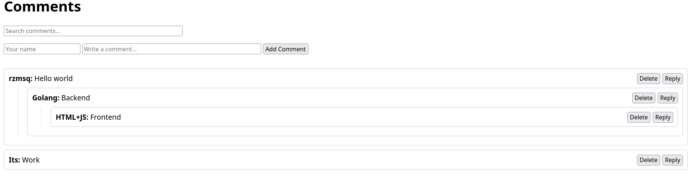

# Дерево комментариев




Веб-сервис для управления иерархической (древовидной) системой комментариев. Он предоставляет RESTful API для создания, получения и удаления комментариев, а также простой веб-интерфейс для взаимодействия.

## Возможности

*   **Иерархические комментарии**: Создание комментариев и ответов, формирующих древовидную структуру.
*   **REST API**: Набор эндпоинтов для управления комментариями.
*   **Полнотекстовый поиск**: Поиск комментариев по ключевым словам.
*   **Веб-интерфейс**: Простой фронтенд на HTML+JS для просмотра, добавления, удаления и поиска комментариев.

## Эндпоинты API

Сервис предоставляет следующие REST эндпоинты:

*   `POST /comments` - Создает новый комментарий. Опционально можно указать `parent_id` для создания ответа.
    *   **Тело запроса (JSON):**
        ```json
        {
          "parent_id": "1",
          "username": "John Doe",
          "text": "This is a comment."
        }
        ```
*   `GET /comments?parent={id}` - Получает комментарий и всех его вложенных дочерних элементов. Поддерживает пагинацию и сортировку.
*   `DELETE /comments/{id}` - Удаляет комментарий и все его поддерево ответов.


## Начало работы

### Установка и запуск

1.  **Клонируйте репозиторий:**
    ```bash
    git clone https://github.com/rzmsq/comment-tree.git
    cd comment-tree
    ```

2.  **Конфигурация:**
    Создайте файл `config.yaml` в корневом каталоге, скопировав файл-пример и заполнив данные для вашей базы данных и сервера.

3.  **Запуск с помощью Docker Compose (рекомендуется):**
    Это запустит приложение и базу данных PostgreSQL.
    ```bash
    docker-compose up --build
    ```

4.  **Локальный запуск:**
    Убедитесь, что у вас запущен экземпляр PostgreSQL и вы правильно настроили `config.yaml`.
    ```bash
    # Установка зависимостей
    go mod tidy

    # Запуск приложения
    go run ./comment_tree/main.go
    ```

По умолчанию сервис будет доступен по адресу `http://localhost:8080`. Веб-интерфейс доступен по корневому URL.

## Структура проекта

Проект следует принципам чистой архитектуры для разделения ответственностей.

```
/
├── comment_tree/       # Основной исходный код приложения
│   ├── adapters/       # Реализации внешних интерфейсов (БД, REST)
│   ├── config/         # Загрузка конфигурации приложения
│   ├── core/           # Основная бизнес-логика (модели, порты/интерфейсы)
│   ├── pkg/            # Переиспользуемые пакеты (логгер, обертка для HTTP-сервера)
│   └── usecase/        # Реализация сценариев использования бизнес-логики
├── web/                # Файлы фронтенда (HTML, JS)
├── config.yaml         # Конфигурация приложения
├── Dockerfile          # Инструкции для сборки Docker-образа приложения
├── docker-compose.yml  # Docker Compose для запуска приложения и БД
└── go.mod              # Определение Go-модуля
```
